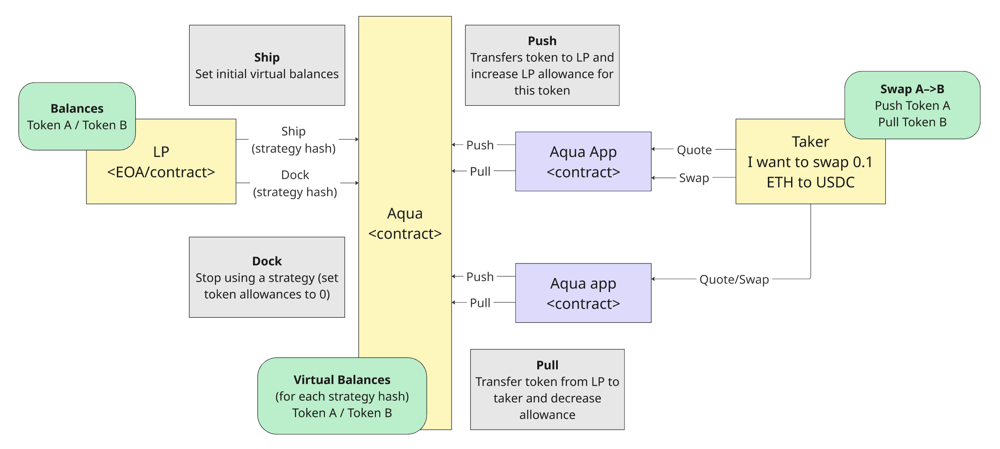
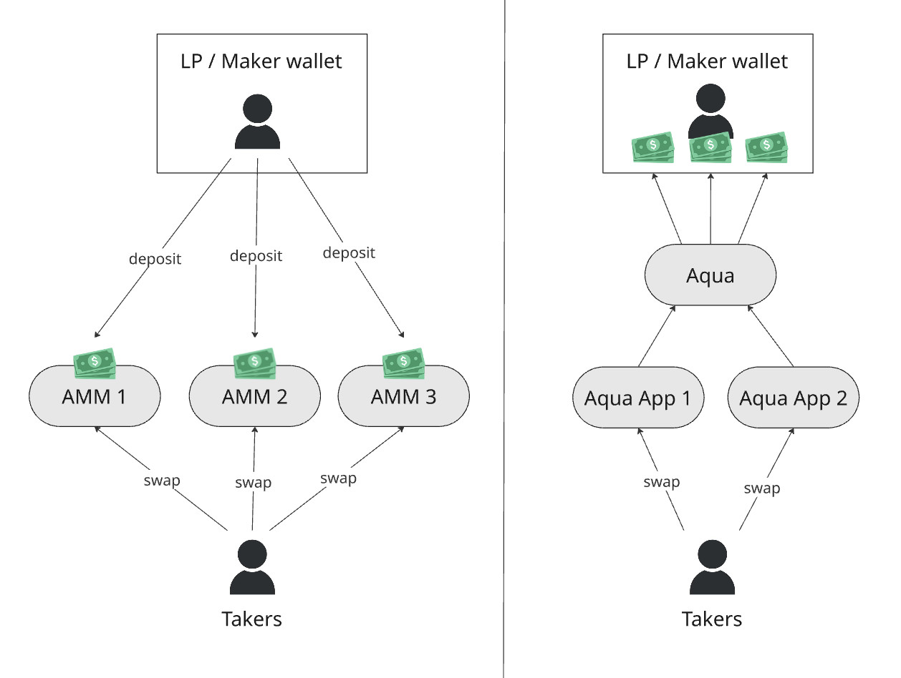
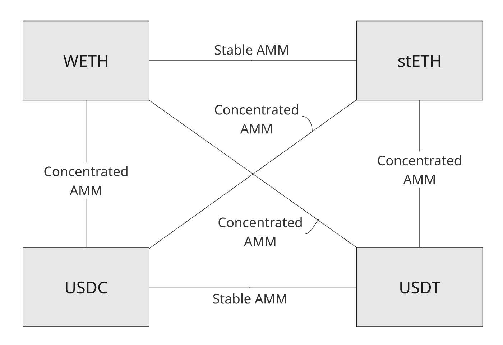

Version: Developer Preview
1.0 Repository: <https://github.com/1inch/aqua>

# Current state of DeFi

In blockchain-based markets, traditional market makers can automate their strategies through self-custody smart contracts, effectively becoming passive liquidity providers to AMMs. This convergence means that in DeFi, the distinction between professional market makers and LPs becomes fluid—MMs can simultaneously act as LPs to AMMs while maintaining their active trading operations. Crucially, AMMs provide 100% availability—their on-chain nature ensures liquidity is always accessible for trading, unlike PMMs that may be offline or choose not to quote.

Traditional AMMs revolutionized DeFi by pooling liquidity from multiple providers into a single smart contract account, achieving O(1) computational complexity for swap operations. This architecture enables takers to trade against the aggregated liquidity of arbitrary numbers of LPs within a fixed gas cost, regardless of how many individual providers contribute to the pool. This pooling paradigm particularly benefits small LPs, who can participate in market making without bearing the prohibitive gas costs of individual order management or matching.

In contrast, Professional Market Makers (PMMs) leverage RFQ (Request for Quote) protocols to connect with order flow from DEXes and aggregators, achieving superior capital efficiency by reusing the same capital across multiple strategies and venues simultaneously. These sophisticated actors bridge liquidity from heterogeneous markets—centralized exchanges, various DEX protocols, and different blockchains—through spatial arbitrage, effectively becoming the connective tissue that unifies fragmented liquidity across the broader crypto ecosystem. Unlike passive AMM liquidity where capital is locked in specific pools, PMMs maintain custody of their funds and deploy them dynamically based on real-time opportunities.

# Problem Statement

AMM pools have become the dominant liquidity infrastructure in DeFi, yet their pooled custody design creates fundamental structural inefficiencies.

First, the vast majority of liquidity in AMM pools sits idle—participating in price-defining formulas but almost never executing actual trades. Analysis of on-chain data reveals that for 90% of days in 2025, 94% of liquidity in Uniswap v2 pools remained unutilized, along with 85% in Uniswap v3[^1] pools, 84% in Uniswap v4 pools, 83% in Curve pools, 89% in PancakeSwap pools, and 97% in Balancer pools[^2]. This idle pool liquidity participates in the AMMs’ price-defining formulas, yet misses its actual trading function. While it shapes the market’s pricing landscape, it fails to capture value from the very market structure it helps create.

Second, LP capital is severely fragmented across the DeFi ecosystem. From the liquidity provider’s perspective, capital must be split across different protocols, each with their own pools, fee tiers, and mechanisms. Within a single protocol, LP capital spreads across numerous trading pairs, markets, and strategies. For concentrated liquidity AMMs, this fragmentation extends further into price ranges. This dispersion creates inefficient capital allocation where LPs must divide their finite capital, leading to popular pairs accumulating excessive reserves while emerging assets struggle to attract meaningful liquidity. LPs face constant allocation decisions between providing depth in established markets or supporting new opportunities, but never achieving both with the same capital.

Third, liquidity deposited into pools becomes DeFi-disabled—locked within pool contracts where its functionality reduces to basic transfers. This capital cannot participate in DAO governance despite representing significant protocol stakes. It cannot be used as collateral in money markets to achieve leverage. It cannot engage in dynamic liquidity borrowing or yield farming opportunities. The tokens lose all protocol-specific utilities that require wallet custody, from gauge voting to staking rewards. LPs face a binary choice: provide liquidity or access DeFi’s broader composability, but never both simultaneously.

These inefficiencies—idleness, fragmentation, and locked capital—compound into a systemic problem where the majority of DeFi’s liquidity remains underutilized, poorly distributed, and functionally isolated from the ecosystem it aims to serve.

# Protocol design

<figure id="fig:aqua-design">

<figcaption>Aqua protocol interactions</figcaption>
</figure>

Aqua’s architecture centers on a virtual accounting system that tracks liquidity allowances without taking custody. This design enables multiple strategies to share access to the same underlying capital while keeping funds in maker-controlled wallets. The protocol acts as a secure accounting layer between liquidity providers (Makers) and trading strategies (Aqua Applications), maintaining balance accounting while assets remain in maker wallets.

At its core, Aqua implements a four-level nested mapping that precisely tracks virtual token balances:

    Virtual balance storage hierarchy:
      Maker Address
        -> Application Address
            -> Strategy Hash (bytes32)
                -> Token Address -> Balance

This data structure defines how liquidity is organized: each Maker can authorize multiple Apps, each App can run multiple Strategies (identified by a hash of their immutable parameters), and each Strategy tracks balances for multiple tokens. The Strategy itself is an ABI-encoded structure—opaque bytes from Aqua’s perspective—that contains all parameters defining the AMM’s behavior (price curves, fee tiers, concentration ranges, etc.). This separation between accounting (managed by Aqua) and trading logic (implemented by Apps) creates a clean, modular architecture.

Makers control their virtual balances through two primary operations: `ship()` to allocate balances to a Strategy, and `dock()` to revoke them. Once shipped, a Strategy’s parameters should not be modified—if a Maker wants different parameters, they must dock the existing Strategy and ship a new one. This design philosophy encourages immutability, bringing significant security benefits: immutable systems have smaller attack surfaces, predictable behavior, and eliminate entire classes of vulnerabilities related to parameter manipulation. The immutable design improves code simplicity through reduced state variability, which naturally leads to fewer bugs. While the AMM never owns the liquidity (only receives shared access), this approach creates more reliable and auditable strategies.

Aqua’s `pull()` and `push()` operations create a unique bi-directional accounting system. When a trade executes, `pull()` decreases virtual balances and transfers tokens from the Maker’s wallet to satisfy the trade. Conversely, `push()` increases virtual balances while sending tokens back to the Maker. Critically, any tokens an AMM receives through trading automatically become available for reinvestment—when assets flow back via `push()`, they immediately expand the Strategy’s usable balance. This automatic reinvestment mechanism means AMMs can efficiently manage their capital: all earned tokens immediately expand available liquidity without requiring manual rebalancing or redepositing.

When a Maker’s actual wallet balance falls below their virtual balance commitments, strategies become illiquid—trades cannot execute because `pull()` operations will revert. Importantly, the AMM continues quoting prices based solely on virtual balances without checking real balances or allowances, preserving price continuity. However, this can expose Makers to losses similar to impermanent loss in constant product AMMs: if prices move unfavorably during the illiquid period, the first executable trade when liquidity returns may lock in those adverse price movements. For AMMs with balance invariants (like x\*y=k), these losses remain bounded by the same impermanent loss mechanics. While Aqua doesn’t automatically pause illiquid positions, Makers are strongly recommended to manually dock strategies that become chronically underfunded to prevent accumulating unfavorable price exposure.

While Aqua’s design naturally suits AMM-style strategies, the protocol extends seamlessly to Professional Market Maker strategies. Liquidity providers can choose to share their capital with PMM strategies through Aqua’s virtual balance system. While this grants PMMs the ability to pull funds (creating custodial exposure), Aqua provides crucial benefits: convenient balance accounting that tracks exactly how much capital each PMM strategy uses, and transparency into capital deployment across different trading venues and strategies. For LPs, this creates an auditable trail of how professional traders utilize their capital, while PMMs benefit from streamlined accounting infrastructure that eliminates the operational complexity of managing separate balance tracking for each LP relationship. The same shared liquidity and unlocked capital benefits apply—LPs can provision the same funds to multiple PMM strategies while maintaining other DeFi utilities.

# Economic considerations

## Capital efficiency in Aqua and traditional AMM pools

<figure id="fig:amm-vs-aqua">

<figcaption>Traditional AMM model vs Aqua</figcaption>
</figure>

The diagram <a href="#fig:amm-vs-aqua" data-reference-type="ref" data-reference="fig:amm-vs-aqua">2</a> contrasts pooled custody with shared allowances. On the left, LPs deposit into a single AMM contract, funds sit locked in the pool, and takers swap directly against that aggregated balance. On the right, LP funds remain in Maker wallets while Aqua sits between Makers and multiple applications’ strategies: takers still swap at the strategy level, but strategies source and return inventory via Aqua’s accounting.

**Dual efficiency mechanisms.** Aqua’s architecture delivers efficiency gains through two distinct but complementary properties. Shared liquidity enhances capital efficiency by allowing the same wallet equity to back multiple strategies simultaneously—multiplying the productive use of capital. Unlocked capital goes further, contributing to both capital efficiency and utility efficiency: assets can be leveraged through money markets (increasing capital efficiency) while simultaneously maintaining governance rights, staking rewards, and other DeFi utilities (utility efficiency). This dual mechanism transforms how LPs think about capital deployment.

**The idle liquidity paradox and Aqua’s solution.** When LPs commit capital to AMMs, they expect yields proportional to their share minus impermanent loss. Yet analysis shows 85-97% of this committed liquidity sits idle—participating in price discovery but almost never executing trades. Traditional AMMs force LPs to accept this fundamental inefficiency: capital generates no fees while still bearing impermanent loss risk. Aqua transforms this idle capital into a multiplicative yield opportunity. The same capital that sits 90% idle in traditional pools can simultaneously provision multiple strategies. While 90% remains idle in any single strategy at a given moment, different strategies activate at different times—multiplying fee generation without additional capital commitment.

**Paradigm shift: From protocol constraint to LP strategy.** Traditional AMMs impose capital efficiency limits through their design—once deposited, capital serves a single pool with fixed parameters. Aqua fundamentally changes this paradigm by transforming capital efficiency from a protocol-imposed constraint into a strategic choice controlled by LPs. Through shared and unlocked liquidity, LPs define their own capital efficiency based on risk appetite and market opportunity. This shift enables LPs to multiply their expected yields by the number of strategies they provision, fundamentally changing the risk-return profile of liquidity provision.

**Multiplicative amplification effects.** The combination of shared liquidity and unlocked capital creates multiplicative, not merely additive, benefits. Consider an LP with 1,000 USD initial capital: they can leverage this through money markets into 3,000 USD of collateral (potentially diversified across three different stablecoins like USDC, USDT, and DAI) and 2,000 USD of debt. This leveraged portfolio of 3,000 USD can then be provisioned across three different Aqua strategies. The result is 9,000 USD of notional liquidity exposure from 1,000 USD of initial equity—a 9x amplification achieved through the multiplication of leverage (3x) and strategy sharing (3x). Critically, while each strategy sees its full provisioned amount for price discovery, actual utilization remains low, allowing the same capital to service multiple strategies’ occasional trades.

**SLAC (Shared Liquidity Amplification Coefficient).** SLAC quantifies how much notional liquidity a given wallet equity can support under Aqua’s shared liquidity model. Formally, SLAC is defined as the ratio of total liquidity provisioned across all strategies to the actual wallet equity backing that liquidity:

``` math
\mathrm{SLAC}
= \frac{\displaystyle \sum_{j=1}^{n} \sum_{k=1}^{|s_j|} l_{s_{j,k}}}{\displaystyle \sum_{i=1}^{m} l_i}
\;\ge\; 1
```

``` math
l_i > 0 \quad \text{for } i = 1,\dots,m,
```
where $`l_i`$ is the liquidity of token $`i`$.

``` math
s_{j,k} \in \{1,\dots,m\}, \quad j = 1,\dots,n,\quad k = 1,\dots,|s_j|,
```
where $`s_{j,k}`$ denotes the index of the $`k`$-th token used in strategy $`j`$.

Through SLAC amplification, Aqua effectively multiplies both liquidity depth and fee-earning potential. When LPs maintain sufficient wallet balances to service pull operations, they earn fees from all provisioned strategies simultaneously—multiplying their yield by approximately the SLAC factor while the underlying capital requirements remain constant due to the asynchronous, low-utilization nature of DEX trading.

Transforming arbitrage from toxic flow to profitable volume. In traditional AMMs, arbitrage is toxic because poor capital utilization—only 5-15% of liquidity actively trades—means the limited fees cannot compensate for impermanent loss. Aqua’s shared liquidity dramatically increases capital utilization: the same capital backs multiple strategies, multiplying the number of trades executed and fees earned. This increased utilization creates enormous capital efficiency, fundamentally changing the economics. With higher utilization rates, capital effectively earns from market-making itself—even pure arbitrage volumes become profitable because the aggregate fees from increased utilization exceed the impermanent loss costs. This shifts the paradigm: instead of viewing AMMs as passive liquidity pools vulnerable to extraction, Aqua transforms them into efficient spread machines. Each strategy implements its own fee model—static fees, dynamic fees that adjust to market conditions, inventory-based spreads, or other custom pricing logic. When utilization increases through sharing, arbitrage transforms from a cost into a revenue stream, as the economics of market-making become profitable at scale.

## Specialization over Homogenization

Traditional AMM pools achieved a critical breakthrough: O(1) computational complexity for swap operations regardless of the number of LPs contributing liquidity. This elegant solution required forcibly homogenizing all LP strategies within a pool—every LP charges identical fees, follows the same pricing curve, and accepts the same risk parameters. A Uniswap v2 pool forces all LPs into 0.3% fees. A Curve pool mandates the same stableswap invariant for everyone. This homogenization was the price paid for computational efficiency.

Aqua makes a deliberate trade-off: it accepts O(n) complexity (where n represents the number of LPs or strategies that must be accessed to fill an order) in exchange for enabling true specialization. Since liquidity is not pooled but remains in individual LP wallets, each swap may need to interact with multiple makers and their strategies. Critically, Aqua liquidity is off-chain discoverable but on-chain accessible—aggregators and solvers must index and track available liquidity through off-chain mechanisms, but execution remains trustless and on-chain. While this fragments liquidity from the taker’s perspective—requiring interaction with multiple sources rather than a single pool—it defragments liquidity for makers who can now deploy capital across diverse strategies simultaneously. This apparent fragmentation for takers is addressed by the existing aggregation infrastructure: DEX aggregators and sophisticated solvers already maintain off-chain indexing systems and route orders across multiple sources to find optimal execution. In the modern DeFi stack, takers rarely interact directly with individual pools anyway—they trade through aggregation layers that handle both discovery and routing complexity on their behalf.

This architectural choice enables the specialization that characterizes mature financial markets. Instead of forcing all participants into identical behaviors, Aqua allows strategy differentiation: one LP might run constant product AMM with static fees, another implements dynamic fees responding to volatility, while a third uses concentrated liquidity with inventory-based pricing. These strategies coexist and compete within the same market, with the most competitive prices naturally attracting order flow.

For builders, Aqua fundamentally changes the basis of competition. Traditional AMM protocols compete primarily on TVL acquisition—success is measured by how much liquidity a protocol can attract and lock. This creates a zero-sum game where protocols fight over the same pool of capital, often through unsustainable incentive programs. Critically, asking LPs to move capital exposes them to two distinct risks: smart contract risk from depositing into new protocols, and opportunity cost from withdrawing capital from existing profitable strategies. This second risk—missing ongoing profits while capital is in transit—creates enormous friction that inhibits liquidity movement even when superior strategies emerge.

Aqua’s shared liquidity concept eliminates the opportunity cost risk entirely. LPs can provision their capital to new strategies without withdrawing from existing ones, allowing them to test innovative approaches while maintaining current positions. This transforms liquidity acquisition from a high-friction process requiring capital migration to a low-friction decision of simply authorizing additional strategies. For builders, this means a superior formula can attract liquidity instantly without requiring LPs to abandon their existing positions. The result is unprecedented formula-based competition: builders compete purely on the merit of their trading algorithms, risk models, and pricing mechanisms. A breakthrough strategy can go from zero to significant liquidity in minutes, not months, elevating formula innovation to an entirely new level.

This shifts the competitive landscape from capital accumulation to intellectual property creation. Since LPs bring their own capital and can instantly add new strategies to their portfolio, success depends on creating genuinely superior trading logic rather than deeper incentive pools. This fosters specialized strategies for distinct market conditions and asset classes—the hallmark of mature financial markets.

## Fair and Unfair Volumes

**The toxic flow misconception.** The DeFi market misunderstands "toxic flow" as value extraction from LPs. This misconception stems from poor capital efficiency in traditional AMMs. In reality, there are only fair volumes and unfair volumes—and both can be highly profitable with proper capital utilization.

Fair volumes represent flow protocols deserve through competitive pricing. When aggregators route trades after comparing prices across venues, the winning protocol earns fair volume—flow it deserved by offering the best price. Unfair volumes are excessive: flow that comes exclusively to a protocol without price optimization for takers. When a dapp sends all trades to its own AMM ignoring better prices elsewhere, when arbitrageurs target specific pools, or when users trade through suboptimal interfaces—these create unfair volumes that exceed what the protocol would earn through fair competition.

Unfair volumes are extremely beneficial—they represent additional flow generating additional fees. A protocol receiving unfair volumes captures more than its competitive share, earning fees from trades it wouldn’t have won on price alone. This excessive flow represents pure additional revenue beyond deserved volumes. The confusion arose because in traditional AMMs with 90% idle capital, even excessive additional volumes couldn’t overcome poor economics. Low utilization meant these additional fees still couldn’t compensate for impermanent loss.

High capital efficiency transforms both fair and unfair volumes into profit. When shared liquidity increases utilization from 10% to much higher levels, the economics completely change. Fair volumes become solidly profitable through competitive spreads. Unfair volumes—the excessive flow beyond deserved amounts—become extremely lucrative because they represent pure additional fee generation on top of an already profitable base. What appeared as toxic extraction was simply excessive flow handicapped by terrible capital efficiency.

Aqua enables strategies to capture both volume types profitably. Through shared liquidity and high utilization, LPs can run strategies optimized for fair competition alongside strategies positioned to capture unfair volumes. The portfolio approach ensures profitability across all flow types, transforming what traditional AMMs labeled as toxic into the most lucrative revenue streams.

# Liquidity Strategy Lifecycle

<figure id="fig:composition-example">

<figcaption>Strategy composition example</figcaption>
</figure>

The operational framework realizes the economic benefits of shared liquidity and unlocked capital, enabling the paradigm shifts described throughout this paper. Funds remain in maker wallets throughout all operations.

**Assembly and activation.** Makers evaluate strategies based on risk-return profiles and market conditions, then call `ship()` to allocate virtual balances without transferring custody. Unlike traditional deposits, activation is pure configuration—enabling instant portfolio construction across multiple strategies (Figure <a href="#fig:composition-example" data-reference-type="ref" data-reference="fig:composition-example">3</a>). Superior strategies attract liquidity immediately, going from zero to significant depth in minutes.

**Utilization: Auto-compounding yields.** The `pull()`/`push()` mechanics create multiplicative returns through automatic reinvestment. When `push()` returns assets, it automatically expands the strategy’s virtual balance, compounding yields without manual intervention. This auto-compounding multiplies the yield benefits of shared liquidity—each strategy’s returns immediately increase its productive capacity.

**Continuous optimization.** Makers dynamically adjust portfolios based on real-time performance, enabling unprecedented strategy benchmarking. Unlike pooled AMMs where larger pools attract disproportionate volume, Aqua allows direct comparison of strategies with identical backing—testing 15 basis points versus 30 basis points on the same pair reveals non-linear fee-volume relationships and optimal revenue points. This parameter optimization varies by pair, range, and market conditions, with makers discovering through parallel experimentation where volume multiplied by fees maximizes. Critically, profit-seeking behavior improves market efficiency: where makers earn most is precisely where they provide greatest market utility. Underperforming strategies are docked while optimal configurations receive increased allocations—all without gas costs for withdrawals or redeposits.

**Retirement.** The `dock()` operation instantly revokes virtual balances without moving funds. Capital flows seamlessly to new opportunities based on performance metrics rather than switching costs, eliminating the friction that typically keeps capital in suboptimal positions.

This lifecycle transforms liquidity provision from static deposits into dynamic portfolio management, enabling the formula-based competition and continuous value optimization that characterizes mature financial markets.

# Security Model and Considerations

Aqua’s security architecture eliminates technical risks while making economic risks transparent and manageable. The protocol’s three security pillars—maker-controlled custody, allowance-based access, and strict balance invariants—create a trust-minimized system that enables all the economic benefits without introducing new attack vectors.

## Technical security: Trust-minimized by design

**Custody remains with makers.** Unlike traditional AMMs that take custody of LP funds, Aqua never holds tokens. The protocol only manages virtual accounting while assets stay in maker wallets. This eliminates entire categories of technical risks: no honeypot attacks, no rug pulls, no admin key compromises. The maximum exposure equals the ERC-20 allowances makers explicitly grant—a transparent, user-controlled parameter.

**Allowance-based access.** Each strategy can only access tokens up to its authorized virtual balance, which cannot exceed the maker’s ERC-20 approval to Aqua. This creates precise, granular risk management where makers control exposure at both the token and strategy level. The allowance model enables instant strategy activation while maintaining strict security boundaries.

**Balance invariants guarantee settlement.** Every `pull()` operation checks real wallet balances, reverting if insufficient. This atomic settlement model ensures trades either complete fully or fail cleanly—no partial fills, no bad debt, no protocol insolvency. The technical infrastructure remains robust regardless of market conditions.

## Economic risks: Transparent and bounded

While technical risks are eliminated, economic risks remain inherent to market making. Aqua makes these risks transparent and manageable through its design.

**Illiquidity as temporary friction.** When wallet balances fall below virtual commitments, strategies cannot execute trades. This creates temporary illiquidity rather than permanent loss. Makers can instantly resolve this by docking underperforming strategies or rebalancing their portfolio. The continuous optimization lifecycle enables rapid response without the friction of unwinding pool positions.

**Impermanent loss remains bounded.** During illiquid periods, if prices move unfavorably, returning liquidity may lock in adverse price movements—similar to impermanent loss in any AMM. However, for strategies with balance invariants (like constant product), these losses remain bounded by the same mathematical limits as traditional pools. The difference: Aqua’s portfolio approach allows hedging across multiple strategies.

**Path-dependent losses in extreme cases.** Certain strategy types (like Dutch auctions) may accumulate unfavorable prices during illiquidity. While these represent real economic risks, they’re strategy-specific rather than protocol-level, and makers can mitigate them by choosing appropriate strategies for their risk tolerance and monitoring approach.

## Operational best practices

To maximize returns while managing economic risks, makers should:

- Set ERC-20 approvals aligned with active strategy needs

- Monitor virtual versus real balance ratios for optimal capital efficiency

- Utilize the continuous optimization lifecycle to dock underperforming strategies quickly

- Diversify across strategy types to hedge market risks

The security model transforms liquidity provision from a trust exercise into pure economic optimization. Technical risks that plague traditional DeFi are eliminated, leaving only transparent market risks that sophisticated makers can model, hedge, and profit from.

# Conclusion

Aqua addresses pooled AMM inefficiencies through virtual accounting maintaining liquidity in LP wallets. With 85-97% of AMM liquidity unutilized, shared liquidity achieves 9x amplification via leverage (3x) and strategy multiplexing (3x). Virtual balance adjustments eliminate opportunity costs, reducing liquidity acquisition from months to minutes.

The protocol accepts O(n) complexity for specialization versus AMMs’ O(1) homogenization. Off-chain discovery with on-chain settlement enables differentiated strategies. Non-custodial architecture eliminates technical risks; economic risks remain bounded by market-making constraints. Atomic settlement prevents insolvency.

This transforms capital efficiency from protocol parameter to user variable. Competition shifts from TVL to formula optimization. The structure exhibits mature market characteristics: specialized strategies, merit-based allocation, continuous optimization. Aqua provides institutional-grade infrastructure while maintaining DeFi’s permissionless properties.

# Terms and definitions

Aqua Application  
A smart contract that implements trading strategy logic and interacts with the Aqua protocol.

Strategy builders  
Developers or teams who design and implement trading Strategies on top of Aqua. Strategy builders focus on pricing logic, execution algorithms and risk management. They use Aqua’s primitives (e.g. ship, dock, pull, push) to consume provisioned liquidity and expose their Strategies as reusable components that Makers and Aqua Applications can opt into.

AMM (Automated Market Maker)  
A class of on-chain exchange protocols where liquidity is pooled into smart contracts, and prices are determined by a predefined formula (e.g, constant product). Traders interact with a shared pool balance instead of posting individual bids/asks.

PMM (Professional Market Maker)  
A market maker that runs its pricing and risk logic off-chain (or in proprietary infrastructure) and quotes prices to venues (RFQ, limit order books, auctions, etc.). PMMs typically manage their own inventory and risk models, and interact with on-chain liquidity via orders or RFQs instead of depositing funds into AMM pools.

LP (Liquidity Provider)  
An entity (user, fund, market maker) that allocates capital to a protocol or strategy so that others can trade against it. In AMMs, an LP deposits tokens into pools; in Aqua, an LP/Maker authorizes Aqua to provision liquidity from its wallet to multiple Strategies.

Maker  
A participant who provides liquidity or quotes (prices) to the market. Makers stand ready to buy and sell, earning fees or spread in return for taking inventory and price risk. In Aqua, a Maker is an LP whose balances are shared across Strategies via virtual provisioning.

Taker  
A participant who consumes liquidity at the prices offered by Makers. Takers submit swaps, market orders, or RFQ requests and accept the quoted price or pool price, paying fees and implicitly compensating Makers for providing liquidity and bearing risk.

Capital efficiency  
A measure of how much notional liquidity or trading exposure a given amount of wallet equity can support under Aqua’s risk checks and virtual balance model. Higher capital efficiency means that the same unit of equity can back more Strategies, markets, or order flow without requiring additional locked collateral in pools.

Utility efficiency  
A measure of how many independent “uses” the same assets can serve at the same time across DeFi. In Aqua, unlocked capital allows tokens to provision liquidity to multiple Strategies while still being usable as money-market collateral, governance or gauge voting power, staking positions, or other protocol-specific utilities, instead of being immobilized inside pool contracts.

[^1]: While Uniswap v3 and v4 employ heterogeneous, range-based liquidity that varies by position, the idleness metrics remain valid as this liquidity still goes unutilized in practice.

[^2]: Source: AMM Pools Idle Liquidity Analytics Dashboard, available at https://dune.com/1inch/idle
